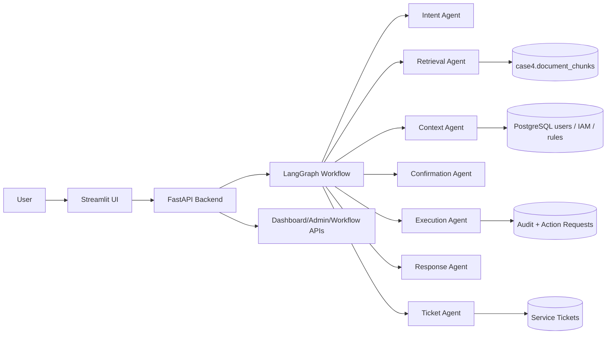

# Architecture

## Component overview

## Layers

1. Presentation: `app/frontend/Streamlit_App.py` and `app/frontend/pages/*`.
2. API: `app/backend/main.py` and `app/backend/api/*`.
3. Workflow: `app/backend/agents/*` and `app/backend/services/workflow_service.py`.
4. Persistence: SQLAlchemy models, schema SQL, workflow state service, audit/ticket services.
5. Knowledge/RAG: ingestion, chunking, embedding, retrieval, lifecycle APIs.
6. Operations: health/readiness/metrics/admin/preflight endpoints and UI pages.

## Runtime controls

The backend applies:

- request ID propagation through `X-Request-ID`,
- JSON structured logs,
- CORS middleware,
- trusted host middleware,
- response security headers,
- optional API-key enforcement,
- centralized exception envelopes.

## Knowledge base architecture

Knowledge documents are registered in `case4.knowledge_documents`. Chunks live in `case4.document_chunks` and carry metadata linking each chunk back to its document revision. Activating or deactivating a revision synchronizes both tables.

## Retrieval architecture

Runtime retrieval uses a hybrid ranker:

- semantic embedding similarity when embeddings are available,
- lexical keyword overlap,
- phrase match boost,
- workflow match boost,
- deduplication by source/chunk index,
- citation metadata in each evidence item.
