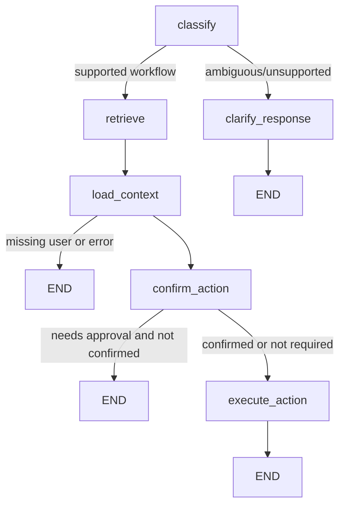

# Workflow Design

## State

The workflow state is defined in `app/backend/agents/schemas.py`. Important fields include:

- `message`
- `employee_id`
- `confirm`
- `request_id`
- `workflow` / `intent`
- `evidence`
- `retrieved_documents`
- `user`, `account`, `rule`
- `needs_confirmation`
- `approval_status`
- `result`
- `response`
- `llm_trace`
- `current_node`
- `workflow_outcome`

## Routing

The graph intentionally stops before retrieval/context/execution for ambiguous requests. It also stops at confirmation until the user explicitly approves.

## Agent responsibilities

- Intent Agent: maps text into a supported workflow or `clarify`.
- Retrieval Agent: fetches evidence from active document chunks.
- Context Agent: loads PostgreSQL employee, IAM, and runbook context.
- Confirmation Agent: persists pending approval state and blocks sensitive execution until approval.
- Execution Agent: invokes mock IAM actions, writes audit records, and builds the response state.
- Response Agent: calls Mistral or fallback logic and enforces the email guardrail.
- Ticket Agent / workflow service: creates a ticket after approved execution.

## User-facing statuses

- `needs_clarification`
- `awaiting_confirmation`
- `completed`
- `failed`
- `in_progress`

The workflow service normalizes raw agent states into these UI-safe statuses.
